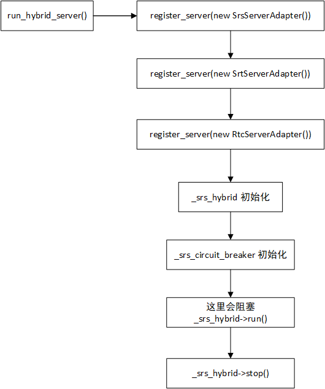
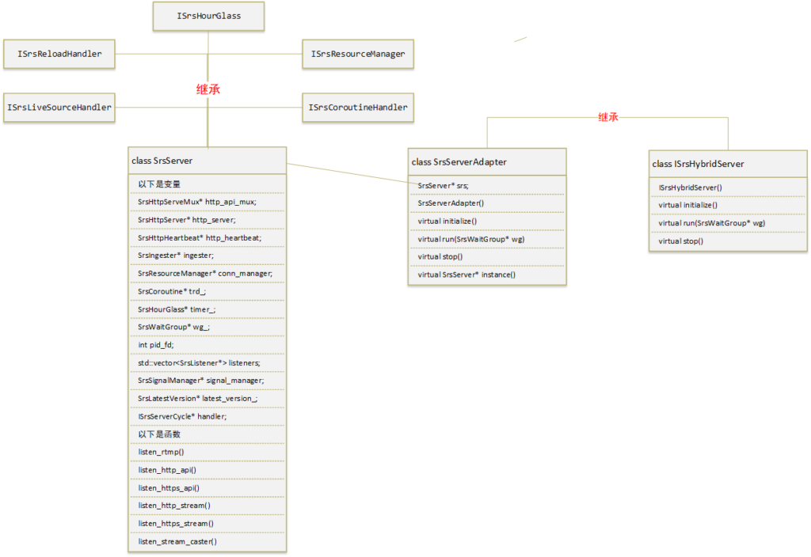
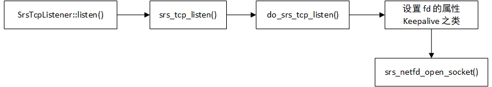
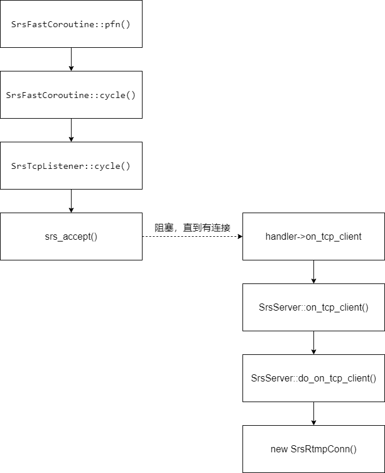
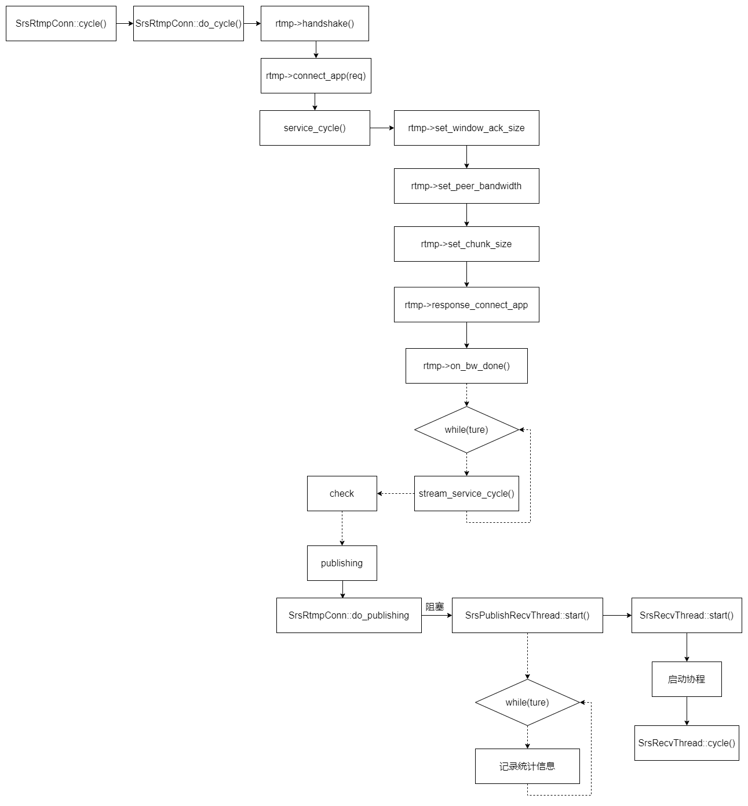

# RTMP

## 寻找RTMP连接入口



把 `Srs`，`Srt`，`Rtc` 服务注册到`_srs_hybrid`。其实就是把上述服务器添加到一个 `std::vector<ISrsHybridServer*> servers`

`_srs_hybrid->run()` 会开启协程，然后一直阻塞

分析 `_srs_hybrid->run()` 函数

```c++
srs_error_t SrsHybridServer::run()
{
    srs_error_t err = srs_success;

    // Wait for all servers which need to do cleanup.
    SrsWaitGroup wg;

    vector<ISrsHybridServer*>::iterator it;
    for (it = servers.begin(); it != servers.end(); ++it) {
        ISrsHybridServer* server = *it;
        //依次启动依次启动Srs，Srt，Rtc服务
        if ((err = server->run(&wg)) != srs_success) {
            return srs_error_wrap(err, "run server");
        }
    }

    // Wait for all server to quit.
    wg.wait();

    return err;
}
```

这里先只关注`RTMP`服务相关的`Srs`服务的启动,即`SrsServerAdapter`类，该类的UML图如下



`SrsServerAdapter` 的 `run` 函数实现如下：

```c++
srs_error_t SrsServerAdapter::run(SrsWaitGroup* wg)
{
    srs_error_t err = srs_success;

    // Initialize the whole system, set hooks to handle server level events.
    if ((err = srs->initialize()) != srs_success) {
        return srs_error_wrap(err, "server initialize");
    }

    if ((err = srs->initialize_st()) != srs_success) {
        return srs_error_wrap(err, "initialize st");
    }

    if ((err = srs->initialize_signal()) != srs_success) {
        return srs_error_wrap(err, "initialize signal");
    }
    //开始监听端口了，listen fd 会保存在对象里面，一个协程监听一个listen fd
    if ((err = srs->listen()) != srs_success) {
        return srs_error_wrap(err, "listen");
    }

    if ((err = srs->register_signal()) != srs_success) {
        return srs_error_wrap(err, "register signal");
    }

    if ((err = srs->http_handle()) != srs_success) {
        return srs_error_wrap(err, "http handle");
    }

    if ((err = srs->ingest()) != srs_success) {
        return srs_error_wrap(err, "ingest");
    }
    //启动Srs服务
    if ((err = srs->start(wg)) != srs_success) {
        return srs_error_wrap(err, "start");
    }
    //
    //省略中间的代码
    //
    return err;
}
```

`srs->listen()`，开始监听端口，代码如下：

```c++
srs_error_t SrsServer::listen()
{
    srs_error_t err = srs_success;

    // Create RTMP listeners.
    //读取配置文件中rtmp服务的ip和端口号，并添加到监听列vector<SrsTcpListener*>
    rtmp_listener_->add(_srs_config->get_listens())->set_label("RTMP");
    //监听列表中分ip和端口
    if ((err = rtmp_listener_->listen()) != srs_success) {
        return srs_error_wrap(err, "rtmp listen");
    }
    //
    //省略中间其他协议服务器的监听器的代码只看RTMP协议的
    //

    if ((err = conn_manager->start()) != srs_success) {
        return srs_error_wrap(err, "connection manager");
    }

    return err;
}
```

分析`rtmp_listener_->listen()`的代码：

```c++
srs_error_t SrsMultipleTcpListeners::listen()
{
    srs_error_t err = srs_success;
    //遍历监听列表，依次开始监听
    for (vector<SrsTcpListener*>::iterator it = listeners_.begin(); it != listeners_.end(); ++it) {
        SrsTcpListener* l = *it;

        if ((err = l->listen()) != srs_success) {
            return srs_error_wrap(err, "listen");
        }
    }

    return err;
}
```

`l->listen()`调用函数`SrsTcpListener::listen()`，代码如下

```c++
srs_error_t SrsTcpListener::listen()
{
    srs_error_t err = srs_success;

    // Ignore if not configured.
    if (ip.empty() || !port_) return err;

    srs_close_stfd(lfd);
    if ((err = srs_tcp_listen(ip, port_, &lfd)) != srs_success) {
        return srs_error_wrap(err, "listen at %s:%d", ip.c_str(), port_);
    }
    
    srs_freep(trd);
    //创建协程
    trd = new SrsSTCoroutine("tcp", this);
    if ((err = trd->start()) != srs_success) {
        return srs_error_wrap(err, "start coroutine");
    }

    int fd = srs_netfd_fileno(lfd);
    srs_trace("%s listen at tcp://%s:%d, fd=%d", label_.c_str(), ip.c_str(), port_, fd);
    
    return err;
}
```

这个函数的调用链如图



函数执行完之后，拿到了监听的文件描述符lfd后开始创建协程

`trd->start()`调用 SrsFastCoroutine::start() 创建一个协程。

```c++
srs_error_t SrsFastCoroutine::start()
{
    srs_error_t err = srs_success;
    
    //忽略

    //创建协程
    if ((trd = (srs_thread_t)_pfn_st_thread_create(pfn, this, 1, stack_size)) == NULL) {
        err = srs_error_new(ERROR_ST_CREATE_CYCLE_THREAD, "create failed");
        
        srs_freep(trd_err);
        trd_err = srs_error_copy(err);
        
        return err;
    }
    
    started = true;

    return err;
}
```

`_pfn_st_thread_create()` 传递的是 pfn， 所以协程实际调用的函数是 `SrsFastCoroutine::pfn(void* arg)`

```c++
void* SrsFastCoroutine::pfn(void* arg)
{
    SrsFastCoroutine* p = (SrsFastCoroutine*)arg;

    srs_error_t err = p->cycle();

    // Set the err for function pull to fetch it.
    // @see https://github.com/ossrs/srs/pull/1304#issuecomment-480484151
    if (err != srs_success) {
        srs_freep(p->trd_err);
        // It's ok to directly use it, because it's returned by st_thread_join.
        p->trd_err = err;
    }

    return (void*)err;
}
```

`pfn()` 实际上是又是调了`SrsFastCoroutine`对象的 `cycle()` 来循环处理业务

```c++
srs_error_t SrsFastCoroutine::cycle()
{
    if (_srs_context) {
        if (cid_.empty()) {
            cid_ = _srs_context->generate_id();
        }
        _srs_context->set_id(cid_);
    }
    
    srs_error_t err = handler->cycle();
    if (err != srs_success) {
        return srs_error_wrap(err, "coroutine cycle");
    }

    // Set cycle done, no need to interrupt it.
    cycle_done = true;
    
    return err;
}
```

实际又是调用`handler->cycle()`，其中`handler`为`ISrsCoroutineHandler`类，`SrsTcpListener`是其派生类，实际就是调用`SrsTcpListener::cycle()`

```c++
srs_error_t SrsTcpListener::cycle()
{
    srs_error_t err = srs_success;
    
    while (true) {
        if ((err = trd->pull()) != srs_success) {
            return srs_error_wrap(err, "tcp listener");
        }
        
        srs_netfd_t fd = srs_accept(lfd, NULL, NULL, SRS_UTIME_NO_TIMEOUT);
        if(fd == NULL){
            return srs_error_new(ERROR_SOCKET_ACCEPT, "accept at fd=%d", srs_netfd_fileno(lfd));
        }
        
        //省略中间代码
        
        if ((err = handler->on_tcp_client(this, fd)) != srs_success) {
            return srs_error_wrap(err, "handle fd=%d", srs_netfd_fileno(fd));
        }
    }
    
    return err;
}
```
 rtmp 连接的处理入口，就是 new SrsRtmpConn()，其调用链如下图



```c++
srs_error_t SrsServer::do_on_tcp_client(ISrsListener* listener, srs_netfd_t& stfd)
{
    srs_error_t err = srs_success;

    //省略

    // Create resource by normal listeners.
    if (!resource) {
        if (listener == rtmp_listener_) {
            resource = new SrsRtmpConn(this, stfd2, ip, port);
        } 

    //省略

    }

    // Use connection manager to manage all the resources.
    conn_manager->add(resource);

    // If connection is a resource to start, start a coroutine to handle it.
    ISrsStartable* conn = dynamic_cast<ISrsStartable*>(resource);
    if ((err = conn->start()) != srs_success) {
        return srs_error_wrap(err, "start conn coroutine");
    }

    return err;
}
```

## 建立RTMP连接

```c++
SrsRtmpConn::SrsRtmpConn(SrsServer* svr, srs_netfd_t c, string cip, int cport)
{
    // Create a identify for this client.
    _srs_context->set_id(_srs_context->generate_id());

    server = svr;

    stfd = c;
    skt = new SrsTcpConnection(c);
    manager = svr;
    ip = cip;
    port = cport;
    create_time = srsu2ms(srs_get_system_time());
    span_main_ = _srs_apm->dummy();
    span_connect_ = _srs_apm->dummy();
    span_client_ = _srs_apm->dummy();
    trd = new SrsSTCoroutine("rtmp", this, _srs_context->get_id());

    kbps = new SrsNetworkKbps();
    kbps->set_io(skt, skt);
    delta_ = new SrsNetworkDelta();
    delta_->set_io(skt, skt);
    
    rtmp = new SrsRtmpServer(skt);
    refer = new SrsRefer();
    security = new SrsSecurity();
    duration = 0;
    wakable = NULL;
    
    mw_sleep = SRS_PERF_MW_SLEEP;
    mw_msgs = 0;
    realtime = SRS_PERF_MIN_LATENCY_ENABLED;
    send_min_interval = 0;
    tcp_nodelay = false;
    info = new SrsClientInfo();

    publish_1stpkt_timeout = 0;
    publish_normal_timeout = 0;
    
    _srs_config->subscribe(this);
}
```

第二个参数`srs_netfd_t c` ，是对原始 `tcp fd`的封装，`skt = new SrsTcpConnection(c)`创建一个Tcp连接管理器`skt`，方便后面对这个`tcp fd`进行读写

`new SrsSTCoroutine("rtmp", this, _srs_context->get_id())`创建了一个协程来处理这个客户端的RTMP连接；该协程通过调用函数`SrsRtmpConn::cycle()`来循环处理`rtmp = new SrsRtmpServer(skt)`在TCP基础上创建的RTMP连接

## 处理RTMP连接




