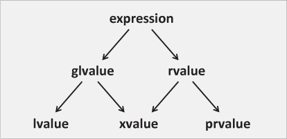

# Perfect Forwarding

## 值类型（C++11）



glvalue(泛左值),简单来说是一个具名对象，都够确定对象、位域或者函数的标识的表达式

- xvalue(将亡值)，表示资源可以被重用的对象或位域。通常其接近生命周期结束，或者通过右值引用转化过来
- lvalue(左值),除了非将亡值的泛左值
  
右值，包括xvalue(将亡值)和纯右值

- 纯右值，能够用于初始化对象和位域，或者能够计算运算符操作数的值的表达式

```c++
// x here is a variable, not an lvalue. 3 is a prvalue initializing
// the variable x.
int x = 3;  
// x here is an lvalue. The evaluation of that lvalue expression does not
// produce the value 3, but a designation of an object containing the value 3.
// That lvalue is then then converted to a prvalue, which is what initializes y.
int y = x;  
```

## 完美转化

不使用模板来传递不同值类型的参数

```c++
#include <utility>
#include <iostream>

class X {
public:
    X() {};
};

void g(X&) {
    std::cout << "g() for variable\n";
}
void g(X const&) {
    std::cout << "g() for constant\n";
}
void g(X&&) {
    std::cout << "g() for movable object\n";
}

// let f() forward argument val to g():
void f(X& val) {
    g(val);             // val is non-const lvalue => calls g(X&)
}
void f(X const& val) {
    g(val);             // val is const lvalue => calls g(X const&)
}
void f(X&& val) {
    g(std::move(val));  // val is non-const lvalue => needs std::move() to call g(X&&)
    g(val);  // val is non-const lvalue => calls g(X&)
}

int main()
{
    X v;              // create variable
    X const c;        // create constant

    f(v);             // f() for nonconstant object calls f(X&) => calls g(X&)
    f(c);             // f() for constant object calls f(X const&) => calls g(X const&)
    f(X());           // f() for temporary calls f(X&&) => calls g(X&&)
    f(std::move(v));  // f() for movable variable calls f(X&&) => calls g(X&&)
}
```

尽管第三个f()中的val被声明为右值引用，但当它被用作表达式时，它的值类别是一个非常数左值。（why?）

将三种函数`f`用一种通用的代码来表示

```c++

//ERROR
//只能表示前两种，无法传递移动对象
template<typename T>
void f (T val) {
  g(T);
}

// perfect forwarding
template<typename T>
void f (T&& val) {
  g(std::forward<T>(val));  // perfect forward val to g()
}
```

```c++
#include <utility>
#include <iostream>

class X {
public:
    X() {};
};

void g(X&) {
    std::cout << "g() for variable\n";
}
void g(X const&) {
    std::cout << "g() for constant\n";
}
void g(X&&) {
    std::cout << "g() for movable object\n";
}

template<typename T>
void f(T&& val) {
    g(std::forward<T>(val));  // perfect forward val to g()
}

int main()
{
    X v;              // create variable
    X const c;        // create constant

    f(v);             // f() for nonconstant object calls f(X&) => calls g(X&)
    f(c);             // f() for constant object calls f(X const&) => calls g(X const&)
    f(X());           // f() for temporary calls f(X&&) => calls g(X&&)
    f(std::move(v));  // f() for movable variable calls f(X&&) => calls g(X&&)
}
```

## 特殊成员函数模板

```c++
#include <utility>
#include <string>
#include <iostream>

class Person
{
  private:
    std::string name;
  public:
    // constructor for passed initial name:
    explicit Person(std::string const& n) : name(n) {
        std::cout << "copying string-CONSTR for ’" << name << "’\n";
    }
    explicit Person(std::string&& n) : name(std::move(n)) {
        std::cout << "moving string-CONSTR for ’" << name << "’\n";
    }
    // copy and move constructor:
    Person (Person const& p) : name(p.name) {
        std::cout << "COPY-CONSTR Person ’" << name << "’\n";
    }
    Person (Person&& p) : name(std::move(p.name)) {
        std::cout << "MOVE-CONSTR Person ’" << name << "’\n";
    }
};

int main()
{
  std::string s = "sname";
  Person p1(s);              // init with string object => calls copying string-CONSTR
  Person p2("tmp");          // init with string literal => calls moving string-CONSTR
  Person p3(p1);             // copy Person => calls COPY-CONSTR
  Person p4(std::move(p1));  // move Person => calls MOVE-CONST
}
```

可以通过完美转化使用函数模板实现传参构造函数

```c++
#include <utility>
#include <string>
#include <iostream>

class Person
{
  private:
    std::string name;
  public:
    // generic constructor for passed initial name:
    template<typename STR>
    explicit Person(STR&& n) : name(std::forward<STR>(n)) {
        std::cout << "TMPL-CONSTR for ’" << name << "’\n";
    } 

    // copy and move constructor:
    Person (Person const& p) : name(p.name) {
        std::cout << "COPY-CONSTR Person ’" << name << "’\n";
    }
    Person (Person&& p) : name(std::move(p.name)) {
        std::cout << "MOVE-CONSTR Person ’" << name << "’\n";
    }
};
```

```c++
  std::string s = "sname";
  Person p1(s);              // init with string object => calls TMPL-CONSTR
  Person p2("tmp");          // init with string literal => calls TMPL-CONSTR
  Person p3(p1);             // Error
  Person p4(std::move(p1));  // move Person => calls MOVE-CONST
```

`Person p3(p1)` 错误是因为C++的重载解决规则：

函数模板可以用非模板函数进行重载。在其他条件相同的情况下，在选择实际被调用的函数时，非模板函数是首选。

对于非常量左值 `Person p` , 没有首选的非模板函数供调用，因此模板参数`STR`被用来作为 `Person& p` 的替代，而对于复制构造函数来说，需要将其转换为常量，但是调用了上述模板构造函数无法转化。

而常量`Person`是可以的，因为可以优先调用`Person (Person const& p)`:

```c++
Person const p2c("ctmp"); //init constant object with string literal
Person p3c(p2c); //OK: copy constant Person => calls COPY-CONSTR
```

可以通过定义一个非常量拷贝构造函数来解决上述问题,使得可以优先调用这个非模板函数

```c++
Person (Person& p)
```

还可以通过`enable_if<>`, 来禁止使用模板

```c++
#include <utility>
#include <string>
#include <iostream>
#include <type_traits>

template<typename T>
using EnableIfString = std::enable_if_t<
                         std::is_convertible_v<T,std::string>>; 

class Person
{
  private:
    std::string name;
  public:
    // generic constructor for passed initial name:
    template<typename STR, typename = EnableIfString<STR>>
    explicit Person(STR&& n)
     : name(std::forward<STR>(n)) {
        std::cout << "TMPL-CONSTR for ’" << name << "’\n";
    }
    // copy and move constructor:
    Person (Person const& p) : name(p.name) {
        std::cout << "COPY-CONSTR Person ’" << name << "’\n";
    }
    Person (Person&& p) : name(std::move(p.name)) {
        std::cout << "MOVE-CONSTR Person ’" << name << "’\n";
    }
};
```

如果STR 不能转化为string类型，`Person p3(p1)` 会禁止其调用模板函数，编译器会选择执行`Person (Person const& p)`。

```c++
std::string s = "sname";
Person p1(s);              // init with string object => calls TMPL-CONSTR
Person p3(p1);             // OK => calls COPY-CONSTR
```
